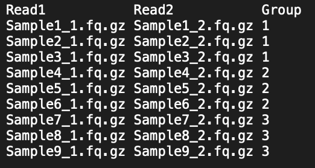

|| [Installation](readme.md) || [Tutorial](tutorial.md) || [Output](output.md) || [Application](uses.md) || 

# Getting started

### Required Input

To generate profiles, you need two input types: (1) one or more reference sequences and (2) short-read sequence data from one or more samples.

1. Reference sequences
  - One or more reference sequence of repeats in [FASTA format]
  - For tips on obtaining reference sequences for groups that lack repeat reference libraries see the full [tutorial](tutorial.md)

2. Sequence data
  - Read files should be in FASTQ format
  - Files should end in the '.fastq', or compressed '.fastq.gz' extension ('.fq' and '.fq.gz' are also supported)
  - Input reads may be paired, or unpaired 
    - If paired data are used, the last string before the file extension should be '_1' for Read1 and '_2' for Read2 (alternatively '_R1' and '_R2' may be used)
  - ex. ‘SampleName_1.fastq.gz’ and ‘SampleName_2.fastq.gz’
  
###### Supported Final Strings and File Formats

|  Input |   |   |   |   |   |   |   |
|---|---|---|---|---|---|---|---|
| Paired Reads   | _R1.fastq | _R1.fastq.gz | _R1.fq | _1.fastq | _1.fastq.gz | _1.fq | _1.fq.gz |   
|                | _R2.fastq | _R2.fastq.gz | _R2.fq | _2.fastq | _2.fastq.gz | _2.fq | _2.fq.gz |   
| Unpaired Reads | .fq.gz    | .fastq.gz    | .fq    | .fastq   | .fastq      | .fq   | .fq.gz   |   
| Reference      | .fa       | .fasta       | .txt   |          |             |       |          |                

Review the sample input data set provided [here]. Also make sure all your files have Unix LF - ie. an empty line at the end of the file. This is standard among all linux and macOS text files.


### Generating Profiles

###### General Command Structure:
```sh
repeatprof profile <-p for paired reads or -u for unpaired> <the reference sequence path > <path of the folder containing reads> [optional flags]
```

###### Functional Command:
```sh
repeatprof profile -p Refs.fa /RepeatProfilerData/Test1
```

###### Explanation:
- 'repeatprof' is the program
- 'profile' is the command that directs the program to generate profiles (see other command options below)
- '-p' indicates the input reads are paired
- 'Refs.fa' specifies the FASTA files containing reference sequences (located in the current directory in this example)
– '/RepeatProfilerData/Test1' specifies the path of the directory containing input read files


###### Optional Flags for Profile:

| Flag| Usage |
|-------------------------------------|---|
| -o <folder_path>                    | direct the final output folder to the specified folder. Default: current directory |
| -corr                               | run correlation analysis. A user_groups.txt is needed for the correlation graph   |
| -usrprov <user_groups.txt path>   | provide path of user_groups.txt Default: current directory                          |
| -k                                  | keep the sorted bam files of the alignments in the final output folder             |
| --very-sensitive                    | bowtie alignment setting. Default: --very-sensitive-local                          |
| --sensitive                         | bowtie alignment setting. Default: --very-sensitive-local                          |
| --very-fast                         | bowtie alignment setting. Default: --very-sensitive-local                          |
| --fast                              | bowtie alignment setting. Default: --very-sensitive-local                          |
| --local                             | bowtie alignment setting. Default: --very-sensitive-local                          |
| --very-sensitive-local              | bowtie alignment setting. Default: --very-sensitive-local                          |
| --sensitive-local                   | bowtie alignment setting. Default: --very-sensitive-local                          |
| --fast-local                        | bowtie alignment setting. Default: --very-sensitive-local                          |
| --very-fast-local                   | bowtie alignment setting. Default: --very-sensitive-local                          |

##### NOTE on Bowtie2 alignment settings: sensitive settings are generally more accurate, but slower, while fast settings are generally less accurate, but faster. See the [Bowtie2 Manual] for more information.

##### NOTE on Flag Arguments: Don't include the <> when typing paths. Also, paths passed into this command cannot have blank spaces.

&nbsp;&nbsp;&nbsp;&nbsp;&nbsp;

### Generating Correlation Analysis
###### Preparing user_groups.txt for -corr
Lets say you want to make a profile for reads you prepared and want to include correlation analysis graphs which show how similar/different read mapping depth are. In order to conduct this analysis reads must be grouped. The manner of grouping is dependent on what you are aiming to get out of this analysis.

###### Generate user_groups.txt:

```sh
repeatprof pre-corr < -u for unpaired reads  or -p paired reads  > <path reads folder>
```

After running this command a file named user_groups.txt will be generated in your current directory based on your reads. In order to use this file for correlation analysis replace the placeholder 'temporary' with your own desired groups.  

###### Verify Correct format and View:

```sh
repeatprof pre-corr -v   
```

###### Example of user_groups..txt


##### NOTE: The user_groups.txt must be in the same directory you are running repeatprof in.

Now you are all set for generating profiles with nice looking correlation groups graph and using the tool. GOOD JOB!

If a run was terminated early or did not complete as expected, use this command to clean up intermediate files created by the tool:
```sh
repeatprof clean   
```

[//]: #
   [here]: <https://github.com/johnssproul/RepeatProfiler/releases/download/0.9/sample_input.zip>
   [FASTA format]: <https://en.wikipedia.org/wiki/FASTA_format>
   [Bowtie2 Manual]: <http://gensoft.pasteur.fr/docs/bowtie2/2.0.0/>
   
