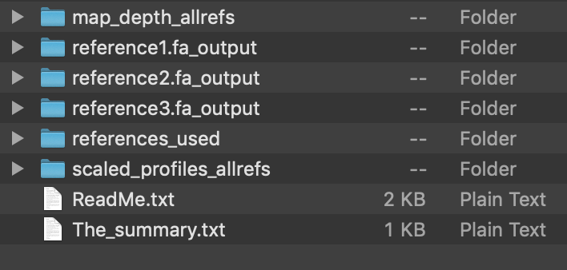
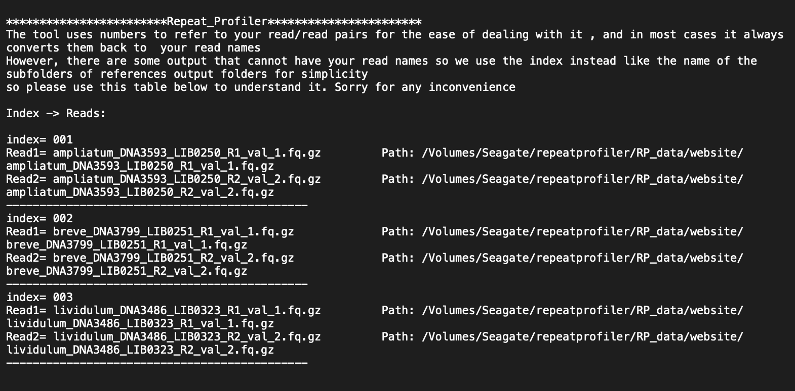
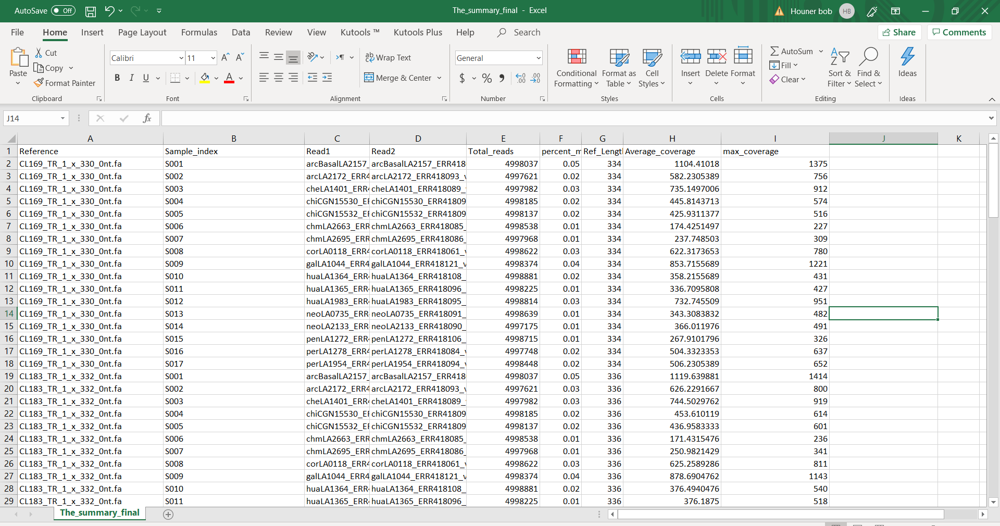
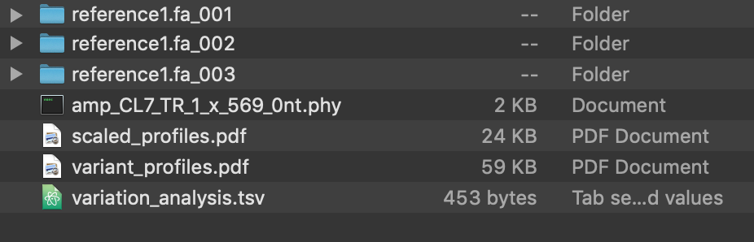
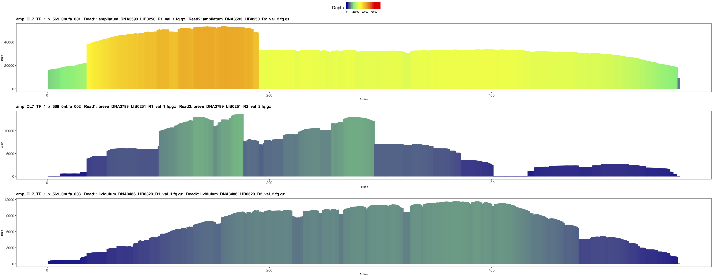
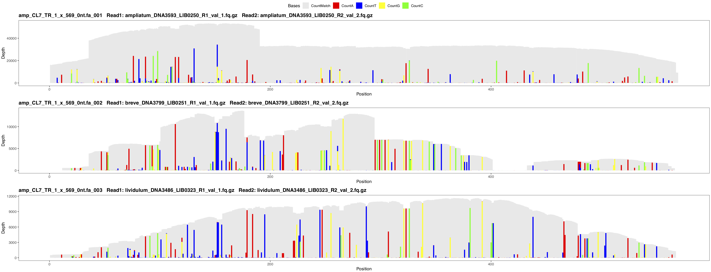
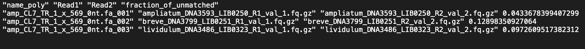

|| [Installation](readme.md) ||  [Getting Started](gettingstarted.md) || [Tutorial](tutorial.md) || [Application](uses.md) || 

# Understanding the Output
This section will help you better understand the ouput files by using output generated by the sample input data.

 - [Refernce Folders](#references)
   - [References Used](#used)
   - [Readme](#readme)
   - [Summary](#summary)
 - [Read (Pair) Folders](#reads)
   - [Indexed Folders](#index)
   - [Combined Horizontal PDF](#horizontal)
   - [Combined Variation PDF](#variation)
   - [Phylip](#phylip)
   - [Variation Analysis](#analysis)

### Output Folder Contents
After running your data, you will find a folder in your current directory or the directory. This folder should be named starting with a time stamp and ending with '-RepeatProfiler'.

The time refers to the time you started the run. If you are using Docker, the time stamp will be in UTC rather than the timezone of your local computer. 

##### Reference Folder
Opening the folder you will find this file structure:

Here, you will see individual folders for each of the references used in the run. Each reference folder contains all the analysis for that refrence. This is done in case you run the analysis with a multi-fasta sequence file. Your refrences are also kept in a single fasta file in Refrences_used folder.

##### Readme 
The ReadMe file contains a summary of the reads used, where they were located, and what index was assigned to each. 

##### Summary
The_summary_final.csv table contains useful information about the refrence length used, average coverage for reads, percent coverage, etc.

##### Read (Pair) Folders
Within each reference folder, there are individual folders for each read or pair of reads used in the run. Lets say we will go the first folder which is named CL3_TR_1_x_53_0nt. The file structure looks like this:

It is in these folders that you will find the real features of the tool. Prepare haha!

Each subfolder belongs to the read or read pair this refrence sequence was run against. (The indices mentioned earlier.) These folders contain the individual profiles produced by RepeatProfiler for the specific read (pair) to reference mapping. To learn more about these profiles, see the [tutorial](tutorial.md) page.

##### Combined Horizontal PDF
The combined_horizontal_colored.pdf file contains all the profiles for this reference in a single file. This makes side-by-side comparisons easier and gives a nice overview of what to expect in the subfolders. Here is a portion of the file produced by this run:

Each of these profiles represent the coverage of the read (pair) when mapped to the specfic refrence (folder name). All the individual profiles are all based on the same scale so differences in color gradients are meaningful. By quickly looking at the profiles it is easy to tell which parts of the refrence sequence have the highest (red) and lowest(blue) coverage. This can tell you a lot about this read and refrence sequence including how and where this sequence is enriched in that species' reads compared to the other species' reads. Color scaling accross different reads will help you in a great way to vizualize differences among very large groups of data.

##### Combined Variation PDF
The combined_variation plots.pdf file contains all the variation profiles for this reference in a single file. Again, this file was produced in order to enhance analytical ability at a glance.

For example, here you can see that sample 001 and 002 which are from the same species share many common polymorphric base A at the same postion (the read bar).

##### Phylip
There is much more information in this plot than to just compare them by eye. These plots were use to produce the phylip file (found in the reference folder). 

Based on the variation plots explained earlier, we were able to capture phylogenetic informative sites from these plots. We analysed each plot indivudaly and recored the bases that had mismatch coverage over 10% from the actual coverage. We also accounted for ambigous sites.

The phylip files are most informative for long refrence sequences (1000+ bases) and can be used in your favorite tree software. We used iq-tree.

The best way to use this file is to run many tests and choose correct refrence sequences corrosponding to what you want to test out. See [applications](uses.md) for more information on how to use RepeatProfiler in conjunction with phylogenetic analysis. 

##### Variation Analysis
The variation_analysis.csv captures information fomr the plots. It contains the fraction of bases that didn't match for each read (pair) for this refrence. Looking at this table, you can discover which plots have the most phylogentic positions and make decsions based on that.  

  
 
