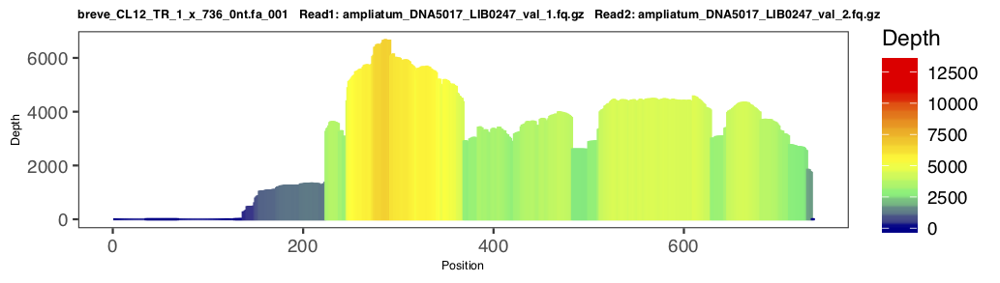
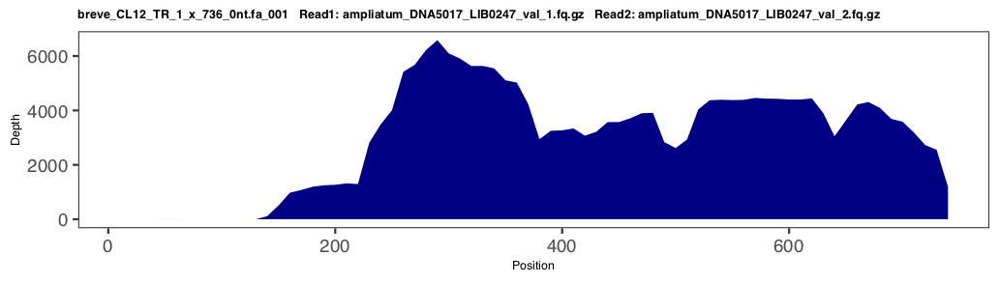
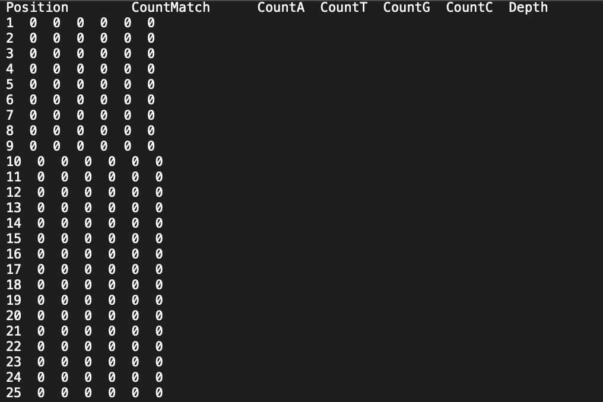
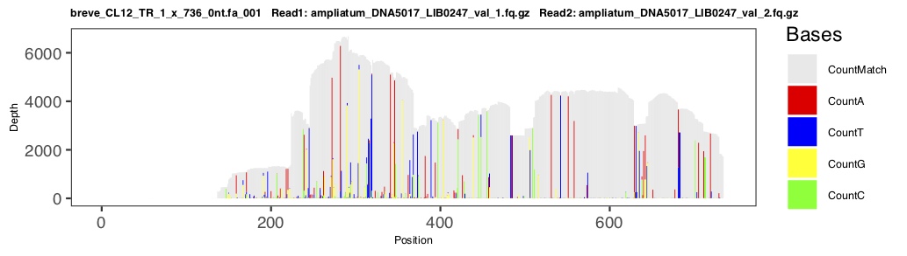
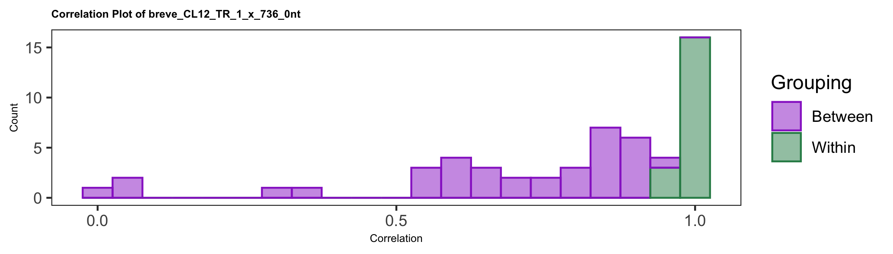
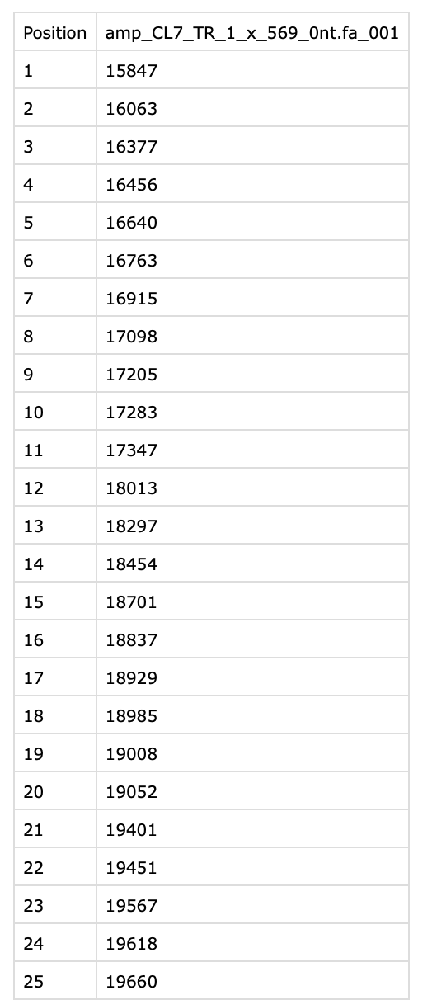
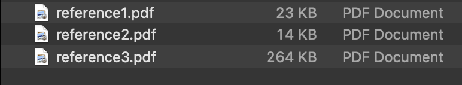

|| [Installation](readme.md) ||  [Getting Started](gettingstarted.md) || [***Output***](output.md) || [Application](uses.md) || 

NEED TO UPDATE PICTURES WITH FINAL VERSION

# Understanding Output
Here, you will find the output generated by the sample input data.

- [Reference Folders](#references)
  - [References Used](#used)
  - [Readme](#readme)
  - [Summary](#summary)
- [Read (Pair) Folders](#reads)
  - [Indexed Folders](#index)
  - [Combined Horizontal PDF](#scaledh)
- [Read Folders](#sample)
  - [Horizontal Profile](#horizontal)
  - [Vector Profile](#vector)
  - [Depth Counts](#dcounts)
  - [Vertical Profile](#vertical)(Optional)
- [Phylogenetic Analysis](#phy)
  - [Combined Variation PDF](#variation)
  - [Variation Plot](#smallvar)
  - [Phylip](#phylip)
  - [Variation Analysis](#var)
- [Correlation Analysis](#corr)
  - [Boxplot by Group](#bygroups)
  - [Boxplot by Reference](#byref)
  - [Histogram](#histogram)
- [Other Folders](#other)
  - [Map Depth (All Refs)](#depth)
  - [Scaled Profiles (All Refs)](#profiles)

### Output Folder Contents
After a successful run, you will find a folder in your current directory or the directory specified when entering the command. This folder should be named starting with a time stamp and ending with '-RepeatProfiler'.

The time refers to the time you started the run and uses the timezone of your computer. If you are using Docker, the time stamp will be in UTC rather than the timezone of your local computer. 

##### Reference Folder<a name="references"></a>
Opening this folder, you will find the following file structure:


Here, you will see individual folders for each of the references used in the run. Each reference folder contains all the analysis for that reference. These individual reference folders will be helpful in navigation if the pipeline is run with a multi-fasta sequence file. Your references are also kept in a single fasta file in the references_used<a name="used"></a> folder.

##### Readme <a name="readme"></a>
The ReadMe file contains a summary of the reads used, where they were located, and what index was assigned to each. The index is used in analyses and sample folder names. 


##### Summary<a name="summary"></a>
The_summary_final.csv table contains useful information about the length of the reference used, average coverage for reads, percent coverage, etc.


##### Read (Pair) Folders<a name="reads"></a>
Within each reference folder, there are individual folders for each read or pair of reads used in the run. These sample folders are labeled with the reference name and the index number<a name="index"></a>. The file structure looks like this:


In these folders, you will find the real features of the tool. Prepare haha!

Each subfolder belongs to the read or read pair the reference sequence was run against. These folders contain the individual profiles produced by RepeatProfiler for the specific read(pair)-to-reference mapping. To learn more about these profiles, see the [tutorial](tutorial.md).

##### Scaled Profiles PDF<a name="scaledh"></a>
The scaled_profiles.pdf file contains all the profiles for this reference in a single file. This makes side-by-side comparisons easier and gives a nice overview of what to expect in the subfolders. Here is a portion of the file produced by this run:


Each of these profiles represent the coverage of the read (pair) when mapped to the specfic reference (folder name). All the individual profiles are based on the same scale, so differences in color gradients are meaningful. By quickly looking at the profiles it is easy to tell which parts of the reference sequence have the highest (red) and lowest (blue) coverage. This can tell you a lot about this read and reference mapping including how and where the reference sequence is enriched in a species' reads compared to other species' reads. Color scaling accross different reads will help you in a great way to vizualize differences among very large sets of data.

### Read Folders<a name="sample"></a>
Each read folder is named as reference_name.index_numeber. Here, you will find the individual profiles associated with specific read-to-reference mappings.

##### Horizontal Scaled Profile<a name="horizontal"></a>
This is the same profile shown in the scaled_profiles pdf located in the references folder. The scale is calculated based on the minimum and maximum across all reads for the reference with the lowest depth being blue and the highest depth, red. The purpose of this file is to provide cleaner information if you are interested in a specific read-to-reference mapping.



##### Simple Vector Profile<a name="vector"></a>
The simple vector profile is a single colored version of the horizontal gradient profile. This profile will be easier to edit for use in papers and posters and such.



##### Depth Counts<a name="dcounts"></a>
This file contains the "per position" information used in plotting the graphs. It contains the depth of every position and mismatches of A, T, C, and G.



##### Vertical Scaled Profile (Optional)<a name="vertical"></a>
This profile is the same as the horizontal scaled and simple vector profile, but with a different style of color gradient. This color gradient goes from bottom to top rather than vertically. 


Because this profile takes much more time to produce algorihtmically and it is the same as two of the other outputs, we decided to leave its production to your discretion. To generate the vertical scaled profile, use the command:

```
put command here
```

### Phylogenetic Analysis<a name="phy"></a>

##### Variant Profiles PDF<a name="variation"></a>
The variant_profiles.pdf file contains all the variation profiles for this reference in a single file. Again, this file was produced to enhance analytical inferences at a glance.


##### Variation Plot<a name="smallvar"></a>
This is the same plot shown in the variant_profiles pdf located in the references folder. The main purpose of this file is to provide cleaner information if you are interested in a specific read-to-reference mapping.



##### Phylip<a name="phylip"></a>
The phylip file (reference_name.phy found in the reference folder) summarizes the variation plot by coding abundant variance as molecular-morphological characters. Both this file and the variation plot were produced from the same raw data.


We were able to capture phylogenetic informative sites using the variation plot and phylip file. We analyzed each read-to-reference mapping indivudaly and recored the bases that had mismatch coverage over 10% from the actual coverage. We also accounted for ambigous sites.

The phylip files are most informative for long refrence sequences (1000+ bases) and can be used in your favorite tree software. We used [iq-tree](http://www.iqtree.org/).

The best way to use this file is to run many tests and choose proper refrence sequences corrosponding to what you want to test. See [applications](uses.md) for more information on how to use RepeatProfiler in conjunction with phylogenetic analysis.


##### Variation Analysis<a name="var"></a>
The variation_analysis.tsv captures information from the plots. It contains the fraction of bases that didn't match for each read (pair) for this reference. Looking at this table, you can discover which plots have the most similar phylogentic positions and make hypotheses based on that.  

 

### Correlation Analysis<a name="corr"></a>

##### Boxplot - by Groups<a name="bygroups"></a>
The correlation boxplot by groups shows boxplots of correlation values for each group (and its outgroups) specified in the user_groups.txt.


##### Boxplot - by References<a name="byref"></a>
The correlation boxplot by references shows boxplots of correlation values for a given reference by ingroup and outgroup.


##### Histogram<a name="histogram"></a>
The correlation histogram plots the correlation for each pair of within and between pairing.



### Other Folders<a name="other"></a>
There are some miscellaneous folders produced. Here is an explanation of each.
 
##### Map Depth (All Refs)<a name="depth"></a>
This folder contains a csv file for each read-reference mapping which shows the depth mapped at each position of the reference.
 

 
##### Scaled Profiles (All Refs)<a name="profiles"></a>
This folder contains the scaled profile pdfs for all references.


