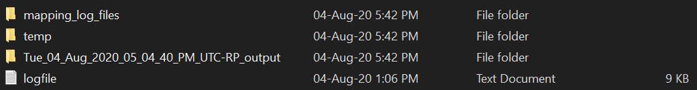
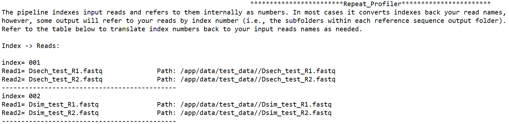
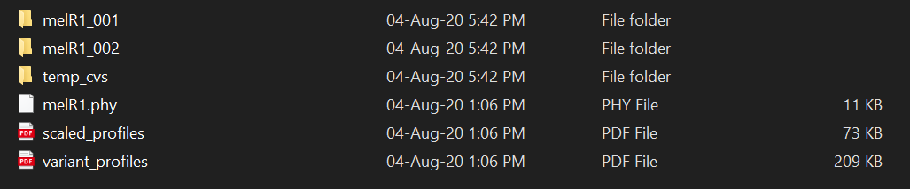
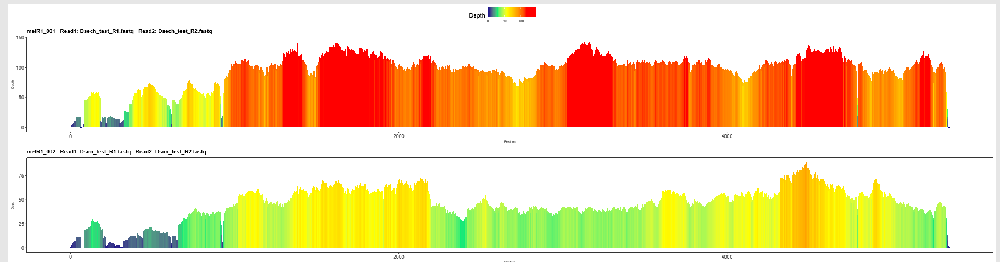
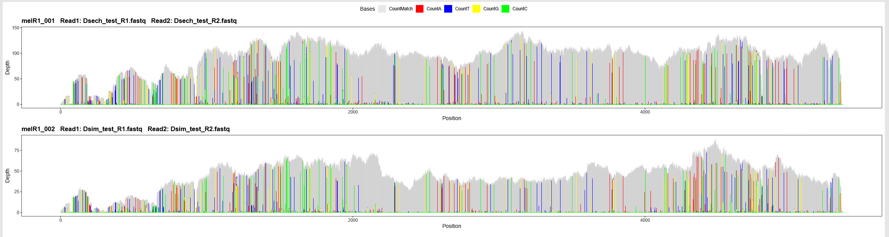
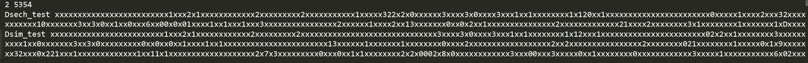
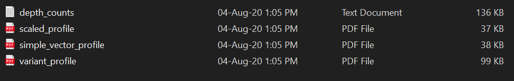

<nav>
    <ul>
      <li><a href="/RepeatProfiler/">Home</a></li>
      <li><a href="/RepeatProfiler/installation">Installation</a></li>
      <li><a href="/RepeatProfiler/gettingstarted">Getting Started</a></li>
      <li><a href="/RepeatProfiler/output" style="color:red">Output</a></li>
      <li><a href="/RepeatProfiler/tips">Tips for Users</a></li>
      <li><a href="/RepeatProfiler/documentation">Documentation</a></li>
      <li><a href="/RepeatProfiler/FAQ">FAQ</a></li>
    </ul>
</nav>

# Output

##### Web page under development.

In this section, we walk through a sample output generated by the sample data, <a href="https://github.com/johnssproul/RepeatProfiler/releases/download/0.96/sample_data.zip" target="_blank">here</a>.

After a successful run, your output will be found in a directory named with a time stamp followed by `-RepeatProfiler`. In the directory, you will find 3 folders: `mapping_log_files`, `temp`, and the primary output folder. The `mapping_log_files` folder has the log files from Bowtie2 which can be useful for troubleshooting problems with your input references, reads, or non-default mapping parameters. The `temp` folder contains program intermediate files that can help us trace errors if there's an issue you can't track down on your own. You will also see a logfile that contains the console output printed during a run.

## Primary Output Folder

The folder named with a time stamp followed by `-RP_output` has the bulk of the program output.

Here, there is one folder named `[refname]_output` for each reference. This folder will have output related to that reference. More on that can be found below.

### `README.txt`

This README tells you how internal index numbers used by the pipeline correspond to your input samples. These indices appear on reference-specific output folders. For example in a folder named 'refname_output_001', the '001' indicates this folder has output for the first set of sample reads processed by the pipeline.

### `Run_summary.csv`

Output also includes the Run_summary.csv table. It contains information about the references you used (e.g. length), average coverage, percent coverage, etc. Since this run included the '-singlecopy' flag which normalizes coverage based on single-copy genes, there will be some info about single copy genes at the bottom of the table.

In this table each row summarizes results of mapping reads from a given sample to a single reference seqeuence. So if you had a run with reads from four samples, and four reference sequences, this table would include 16 rows, with four for each reference sequence corresponding to each of the four samples that were mapped.

### `plots_single_copy`

This folder is only generated if the '-singlecopy' normalization flag is used. It has coverage profiles for each single copy gene. This helps confirm that read mapping patterns on single-copy genes are in line with expectations and lead to reasonable normalized estimates (i.e., they don't show some unexpectedly high coverage region that could skew estimates).

### `map_depth_allrefs`

This folder has some raw data with depth per postion for every sample within a reference sequence.

### `[refname]_output` 

##### melR1_output 

The contents of this folder look like this:

The subfolders contain ouput, including profiles, for each sample (i.e. set of reads) included in the run. As mentioned earlier, the numbers appended to folder names are internal indexes that correspond to input sample reads. We will go into the subfolders later.

`scaled_profiles.pdf`

This file groups color-enhanced profiles for all samples into the same PDF. All profiles are shown on the same relative color scale, which makes it easy to scan profiles of all samples for this reference and note interesting patterns. Any single profile shown can be found as a single PDF in the sub-folders mentioned above that are indexed by sample.

`variant_profiles.pdf`

Another summary PDF in this directory is variant_profiles.pdf. This file contains variant-enhanced profiles for all samples within this reference. These profiles show base-pair resolution of variants relative to the reference sequence across samples, which can also reveal interesting patterns when compared across samples. Again, files with individual profiles for each sample are available in the sample-specific subfolders in this directory.

`[refname].phy`

This file summarizes signatures in variant-enhanced profiles by encoding abundant variants at each site as molecular-morphological characters (details on this process are provided in our paper on RepeatProfiler). This file can be directly fed into phylogenetic software and analyzed as morphological data. We commonly do this using <a href="http://www.iqtree.org/" target="_blank">IQ-TREE</a>. This approach leverages the statistical framework of phylogenetic analysis to group samples based on signal from variant profiles.

`References_summary_base_coverage.csv`

This file reports the average fraction of bases with at least 1X coverage for each reference sequence. We have used this file in runs that include many (i.e., hundreds) of repeat reference sequences to help us filter out low-coverage repeats.

### Sample Specific Subfolders

##### melR1_001

The contents of this folder look like this:

These subfolders contain the same plots we looked at earlier but stored as individual PDFs. Although they are not grouped with all other samples, they still show the same standardized color scale used in the `scaled_profiles` PDF shown above. The `simple_vector_profile` shows a simplified version of the profiles (an area plot instead of a bar plot). We include this as a smaller, but still vector-based file that may be useful for some visual display purposes. This folder also includes `depth_counts` which has raw output of depth of every postion and variants relative to the reference sequence. 

### `scaled_profiles_allrefs`

This folder contains color-enhanced profiles for the entire run (i.e., all reference sequences) that are shown on the same color scale. This is similar to the `scaled_profiles.pdf` file found in the output folders for each reference sequence, except that the color scale is set based on the maximum coverage for all profiles in the run, instead of the maximum observed within a reference sequence. Scanning the PDFs in this folder is a good way to identify interesting patterns across repeats.

### Correlation Analysis Output

Four output folders are generaged by the correlation analysis (i.e., '-corr' flag).

`correlation_boxplots_by_group`

This folder contains boxplots for each group defined in user_groups.txt. The boxplots combine correlation values across all repeat references used in the run. Each group has its own plot.

`correlation_boxplots_by_reference` 

This folder contains boxplots that show correlation of profile shape within and between user-defined groups for individual repeat references in the run.

`correlation_data` 

This folder contains correlation matrices for each reference. The matrices show all the correlation values among all samples for a reference. Each refrence has its own matrix.

`correlation_histograms` 

This folder contains histograms of within and between-group correlation values for each reference.

`correlation_summary.csv` 

This table contains average values of within and between each group correlation values for each reference. It summarizes information for all correlation done in the run.

## Troubleshooting

If you get a formatting error related to reference sequences, check that the file is in FASTA format and that it has Unix LF (an empty line at the end of the file) -- this is standard among all linux and macOS text files.

          
