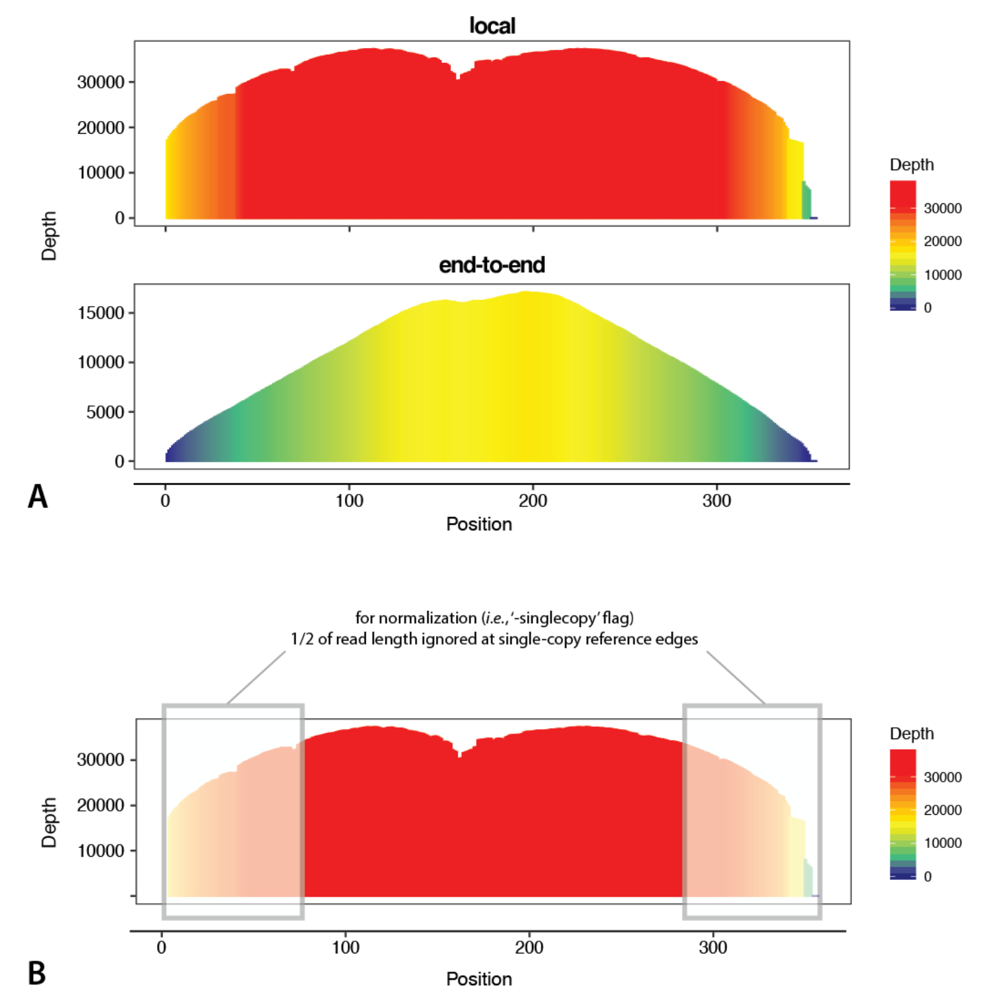

<nav>
    <ul>
      <li><a href="/RepeatProfiler/">Home</a></li>
      <li><a href="/RepeatProfiler/installation">Installation</a></li>
      <li><a href="/RepeatProfiler/gettingstarted">Getting Started</a></li>
      <li><a href="/RepeatProfiler/output">Output</a></li>
      <li><a href="/RepeatProfiler/tips" style="color:red">Tips for Users</a></li>
      <li><a href="/RepeatProfiler/documentation">Documentation</a></li>
      <li><a href="/RepeatProfiler/FAQ">FAQ</a></li>
    </ul>
</nav>

# Getting the Most Out of RepeatProfiler

<ul>
  <li><a href="#obtaining">Obtaining Reference Sequences</a></li>
  <li><a href="#prepare">Things to Consider as You Prepare Runs</a></li>
  <ul>
    <li><a href="#divergence">For runs with multiple species, is there a limit to the evolutionary divergence that can be spanned by my taxon sampling?</a></li>
    <li><a href="#mapping">How does RepeatProfiler handle read mapping?</a></li>
    <li><a href="#satdna">How should I approach making profiles of tandem repeats (e.g., satDNAs) and/or short reference sequences?</a></li>
    <li><a href="#multi">For multi-species runs, which species should serve as the source of reference sequences?</a></li>
  </ul>
  <li><a href="#validation">Validation Methods</a></li>
  <ul>
    <li><a href="#bowtie">Bowtie2 Parameters</a></li>
    <li><a href="#normlaization">Normalization</a></li>
    <li><a href="#sequence">Sequence Divergence</a></li>
  </ul>
</ul>

<h2 id="obtaining">Obtaining Reference Sequences</h2>

Reference sequences may be obtained from existing or new repeat libraries (generated by analyzing genome assemblies with repeat software such as <a href="https://github.com/Dfam-consortium/RepeatModeler" target="_blank">RepeatModeler</a>), online databases (<a href="https://www.girinst.org/repbase/" target="_blank">Repbase</a>, <a href="https://dfam.org/home" target="_blank">Dfam</a>), or *de novo* assembly of repeats from the same low-coverage reads used as input for RepeatProfiler. The last approach is a good option for those wanting to explore repeat profiles in taxonomic groups with limited genomic resources (e.g., no nearby genome assemblies) and/or poor representation in repeat databases. This can be done by first characterizing repetitive sequences using software such as <a href="http://repeatexplorer.org/?page_id=818" target="_blank">RepeatExplorer2</a> or <a href="https://github.com/clemgoub/dnaPipeTE" target="_blank">dnaPipeTE</a> which assemble/annotate repeats from low-coverage shotgun data. We have had good outcomes using both programs as a source of reference sequences.

RepeatExplorer2 output includes Tandem Repeat Analysis which produces consensus sequences of tandem repeats in FASTA format. These tandem sequences can be directly fed into RepeatProfiler as reference sequences. This can be a particularly effective approach to obtaining reference sequences of satellite DNAs (see below for more tips on <a href="#satdna">making profiles of satellite DNAs and other tandem repeats</a>).

RepeatExplorer2 also produces contigs assembled from clustered reads in which some, but not all contigs may correspond to overlapping regions of the same repetitive element. We have sometimes filtered this output to identify long contigs which we have used as reference sequences. Contigs from clustering output could also be aligned and collapsed into a consensus sequence using an alignment editor for repeat clusters of interest.

We have also had good success mining DnaPipeTE output for reference sequences when we are trying to obtain full-length reference sequences of specific transposable elements from short-read data. DnaPipeTE assembles repeats using Trinity and outputs useful lists that summarize contig length and annotation details. We use these lists to identify contigs in the Trinity assembly output that can serve as reference sequences of specific transposable elements. By combining these assembly/annotation tools with the data visualization and comparative analysis features in RepeatProfiler and similar tools (e.g., <a href="https://github.com/W-L/deviaTE" target="_blank">DeviaTE</a>) it is possible to conduct extensive discovery and hypothesis testing of repeat dynamics in any group with nothing more than low-coverage (>1X) short read data.

<h2 id="prepare">Things to Consider as You Prepare Runs</h2>

Does your analysis seek to explore repetitive element patterns for the first time in your group, or are you asking targeted questions with prior knowledge of the repetitive elements of interest? The answer to this question may affect your general approach to using the pipeline.

If you are exploring repetitive element dynamics for the first time in your group, any notable profile variation across samples may be interesting. You may be supplying whatever repetitive element reference sequences are readily available and using graphical output to scan for interesting patterns of variation in profiles. For this approach, the fact that RepeatProfiler’s default read mapping settings are permissive of moderately diverged sequences will be helpful in quickly identifying major sources of variation across reference sequences and samples. For example, if the run includes one reference of a particular transposable element, say a gypsy element, and there are several somewhat closely related gypsy elements in that species, reads from several of those elements may map to the single gypsy element you provided as a reference. In this way, a single profile can summarize the abundance of multiple closely related repetitive elements. If gypsy elements are rare in a different species included in the same run, the profile for that species’ gypsy element will reflect that rarity. Thus, for some applications like species delimitation, or genome evolution studies seeking to identify major sources of repeat variation across samples, users may have good results by profiling a limited number of reference sequences representing several broader categories of repetitive elements. (See the previous section for tips on <a href="#obtaining">obtaining reference sequences</a>.)

For applications that ask more targeted questions about dynamics within a specific repetitive element or group of elements, it may be important to supply a more exhaustive list of relevant reference sequences. For example, if you are investigating differences across the various gypsy elements within a species you may want to map reads to an entire repeat library, such that reads have a chance to map in their optimum position across all gypsy elements. In this way, profiles will better reflect fine-scale abundance patterns within gypsy elements, whereas the profile in the previous paragraph’s example would potentially summarize diversity of several gypsy elements in a single profile. Studying the variant-enhanced profiles which are part of RepeatProfiler’s output can help you get a sense of the sequence-level variation present across mapped reads that contribute to a given profile. We note that DeviaTE is another tool users may find useful that takes a similar approach to analyzing repetitive element dynamics. It generates depth profiles similar to RepeatProfiler, and has complimentary features that can add additional insights to TE-specific dynamics.

<h3 id="divergence">For runs with multiple species, is there a limit to the evolutionary divergence that can be spanned by my taxon sampling?</h3>

In general, we developed RepeatProfiler to generate and compare profiles across relatively short evolutionary time scales (populations, species, species complexes, larger clades of relatively recent divergence). Within a run, RepeatProfiler maps reads from all samples to the same set of reference sequences, so it is important that your samples share enough sequence similarity that reads will map to a given reference sequence. Read mapping will drop off with increasing evolutionary distance between samples, and for faster-evolving reference sequences. See “<a href="#multi">For multi-species runs, which species should serve as the source of reference sequences?</a>” for more discussion on this topic.

<h3 id="mapping">How does RepeatProfiler handle read mapping?</h3>

For a given sample in the run, reads are mapped to all reference sequences simultaneously with bowtie2 using the “very-sensitive-local” presets. These settings maximize mapping of somewhat divergent reads, as well as mapping near the ends of reference sequences. These settings enable users to map reads from multiple species with low to moderate sequence divergence to the same set of reference sequences. The value in this approach is that any variation in profile shape can then be compared across all input samples relative to a fixed point of reference. If sample-specific reference sequences were used, differences in reference sequence length/the presence of indels would prevent direct shape comparison. 

Remember you can always change bowtie settings within RepeatProfiler, or even map reads prior to running RepeatProfiler with the read mapper of your choice, and feed those BAM files into the pipeline (using “-bam”, thus skipping the internal read mapping step.

<h3 id="satdna">How should I approach making profiles of tandem repeats (e.g., satDNAs) and/or short reference sequences?</h3>

Profiles of tandem repeats such as satellite DNAs (satDNAs) can be interesting elements to analyze because they often show major variation across very short evolutionary time scales. There are a couple things specific to tandem repeats you might consider when using them as reference sequences. First, do you care about patterns at the junctions between tandem repeats? If so, it may be helpful to use dimers (or larger mers) as reference sequences, rather than a single copy of the repeat of interest. By mapping to a dimer, it is easier to see the true profile shape at the tandem junctions as read mapping artefacts are more common near the ends of reference sequences (see the figure below). 

You might also consider the length of your reference sequence. Tandem repeats commonly have relatively short repeat units, which means larger fractions of resulting profiles will be affected by read mapping artefacts near the ends of reference sequences. For repeat units that are shorter than or similar to the length of reads being mapped, concatenating multiple copies of the repeat, such that the concatenated reference sequence length exceeds the read length, will produce profiles that are more straightforward to interpret than profiles of shorter reference sequences. In cases where reference sequences comprise concatenated tandem repeats, the user can annotate the boundaries of each repeat unit by including a BED file containing annotation coordinates for each reference using the “-bed” flag. We provide tips for obtaining reference sequences of tandem repeats including satDNAs <a href="#obtaining">here</a>.

<h3 id="multi">For multi-species runs, which species should serve as the source of reference sequences?</h3>

The short answer is that it depends on the taxon sampling and study questions specific to each project and is likely worth exploring yourself if it seems relevant to your study. 

With that said, we often think of two axes of variation when considering this question. First, what is the evolutionary scale of our taxon sampling? And second, how fast-evolving are the repetitive elements we are analyzing? The longer the evolutionary time scale and the faster evolving the repetitive element, the more the species identity of the reference will matter because sequence divergence of the reads being mapped to the reference will have an increasing effect on profile shape.

In our limited exploration of this question, we observe that changing the species identity of reference sequences often has only a marginal impact on resulting profiles when comparisons are being made across short evolutionary time scales (e.g. complexes of closely related species where divergence likely occurred in the last few million years). At these time scales, “interesting” profiles (e.g., those where notable variation exists among study species) tend to show similar signals regardless of the species used as a reference. Across deeper evolutionary splits, changing the species identity of reference sequences will lead to less predictable changes in profile shape as sequence divergence disproportionately affects the rate of read mapping in samples that are most divergent from the reference. In studies spanning deeper evolutionary splits, it may be beneficial to profile samples using references from multiple species chosen across the taxon sampling. Note that if you want to analyze reference sequences from multiple species in your data set, we recommend you separate them across different RepeatProfiler runs. If they are all included in the same run, mapped reads will be divided among the multiple references for each repetitive element since reads are mapped to all references simultaneously within a run.

We notice similar patterns with sequences evolving at different rates. Repetitive elements with domains under evolutionary constraints such as open reading frames, transposable elements, ribosomal DNA sequences, and high-copy genes may be less sensitive to changing the species identity of the reference sequences (and also tend to produce consistent profiles across deeper evolutionary splits) than repetitive elements that show rapid sequence turnover across their entire length (e.g., satellite DNAs).

          
