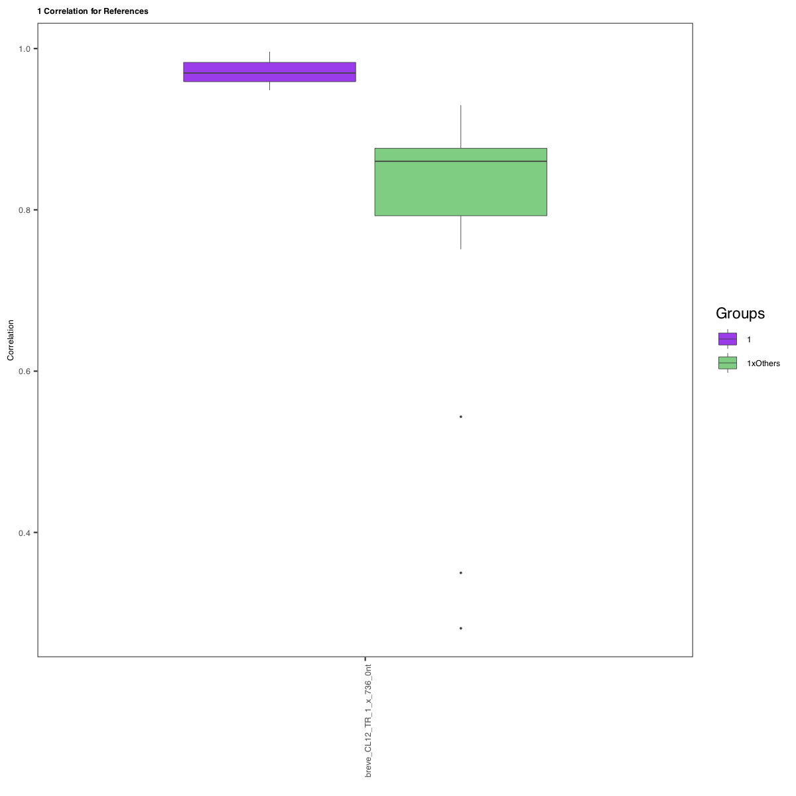
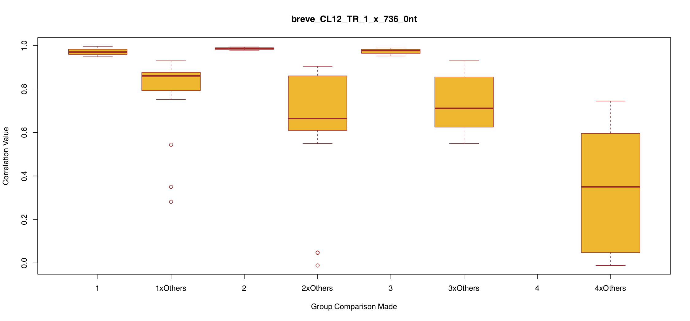
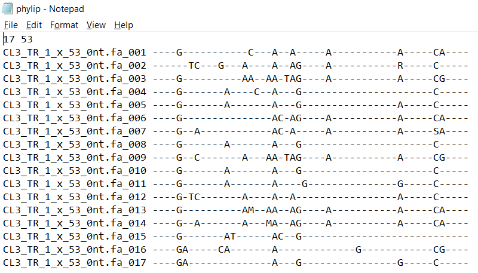

|| [Getting Started](gettingstarted.md) || [Tutorial](tutorial.md) || [Output](output.md) || [Application](uses.md) || 

# Tutorial

In the subfolders for specific read-reference mappings are the individual profiles associated with that mapping.

### Basic Profiles

##### Horizontal Gradient Profile
This is the same profile shown in the combined pdf located in the references folder. The scale is based on all reads for the specific reference with the lowest depth being blue and the highest depth, red. The main purpose of this file is to provide cleaner information if you are interested in a specific read-reference mapping.

##### Solid Profile
The solid profile is a single colored version of the horizontal gradient profile. It is provided to allow for easier editting of the profiles for papers and posters and such.

##### Pileup Counted
This file contains the information per position in the reference sequence. It contains the depth of every position and mismatches of A, T, C, and G.

##### Vertical Gradient Profile (Optional)
This profile is the same as the horizontal gradient and solid profile, just with a different style of color gradient. This color gradient goes from bottom to top rather than right to left. Because this profile takes much more time to produce algorihtmically and it is the same as two of the other outputs, we decided to leave its production to your discretion.

### Correlation Plots

##### Correlation - Groups by Reference

##### Correlation - References by Groups

### Phylogenetic Analysis

##### Variation Plot
This is the same plot shown in the combined pdf located in the references folder. The main purpose of this file is to provide cleaner information if you are interested in a specific read-reference mapping.

##### Phylip
There is much more information in this plot than to just compare them by eye. These plots were use to produce the phylip file (found in the reference folder). 

Based on the variation plots explained earlier, we were able to capture phylogenetic informative sites from these plots. We analysed each plot indivudaly and recored the bases that had mismatch coverage over 10% from the actual coverage. We also accounted for ambigous sites.

The phylip files are most informative for long refrence sequences (1000+ bases) and can be used in your favorite tree software. We used iq-tree.

The best way to use this file is to run many tests and choose correct refrence sequences corrosponding to what you want to test out. See [applications](uses.md) for more information on how to use RepeatProfiler in conjunction with phylogenetic analysis.
