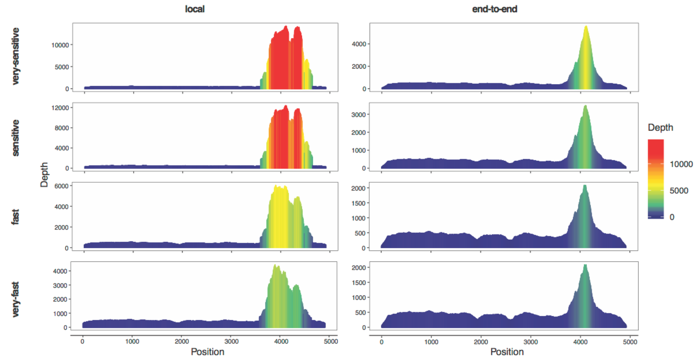
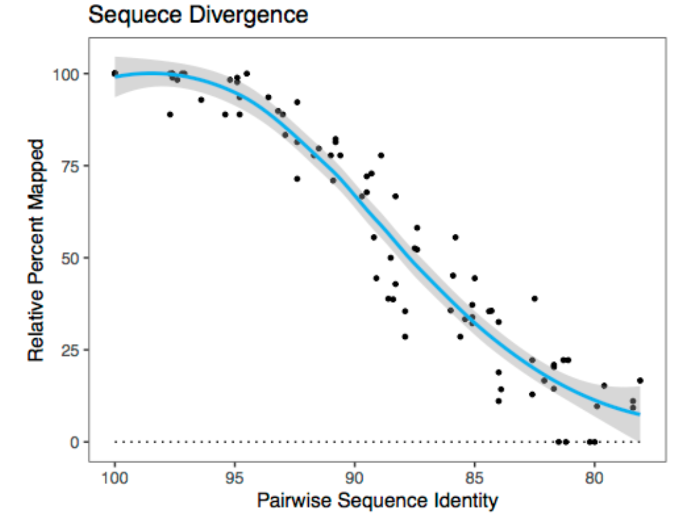

|| [Installation](readme.md) || [Getting Started](gettingstarted.md) || [Tutorial](tutorial.md) || [Output](output.md) ||

# Getting the Most out of Repeat Profiler 

### Normalization
things to talk about here
- how normalization affects the results
- normalization command

### Obtaining Reference Sequences
how do we do this? RepeatExplorer?

### Using Common Reference Sequence
what does this mean?

##### Bowtie2 Parameters
The Bowtie2 setting affects how the reads are mapped to the reference and therefore what the resulting profile will look like.
things to talk about here

- the effects of different settings, benefits and cons
- The default setting for Bowtie2 read mapping is end-to-end. This setting maps reads only if the alignment contains all the characters of the read. In contrast, the -local tag indicates that these alignments may omit a few characters in the alignment if it improves the total alignment score of the read. (cite Bowtie2 manual)
 
##### Sequence Divergence
things to talk about here
 
- farther the reference is from the reads species-ly, the less coverage and less accurate the profiles will be

# Examples
which ones, what data
